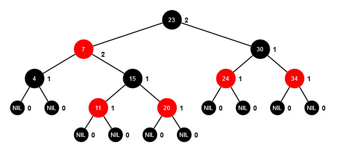

# red-black-tree
This repository contains my implementation of a Red-Black Tree (RBT) in Python, done as part of the Advanced Algorithms and Data Structures course at the Faculty of Electrical Engineering in Sarajevo. The implementation was modeled after the pseudocode found in the book "<a href="https://mitpress.mit.edu/9780262046305/introduction-to-algorithms/">Introduction to Algorithms</a> ".

# Red-Black Tree
  
A Red-Black Tree is a type of self-balancing binary search tree. It maintains balance by adhering to the following properties:

1. <strong>node coloring</strong> - each node in the tree is colored either red or black
2. <strong>root property</strong> - the root node is always black
3. <strong>leaf property</strong> - every leaf (NIL or null node) is black
4. <strong>red property</strong> - if a red node has children, they must be black (no two consecutive red nodes on any path)
5. <strong>depth property</strong> - for each node, any simple path from this node to any of its descendant leaves has the same black depth (number of black nodes)

# 📁 Project structure
The project is organized with the following directory structure:

```bash
red-black-tree/
│
├── main.py
├── tests/
│   └── test.py
│
└── classes/
    ├── RBColor.py
    ├── RBNode.py
    └── RBTree.py
```

- main.py - main entry point, contains a simple console program which allows you to perform basic operations (insert, delete and inorder traversal) on a test tree through the terminal

- tests/ - holds unit tests for the project
  - test.py - contains two simple unit tests 

- classes/ - contains the main classes required for your Red-Black Tree implementation
  - RBColor.py - definition of the possible colors for the Red-Black Tree nodes (RED, BLACK)
  - RBNode.py - definition of the node structure used in the Red-Black Tree
  - RBTree.py - implementation of the Red-Black Tree data structure

# 🔎 Implementation details

The Red-Black Tree itself is represented by RBTree class with following attributes:

- <strong>root</strong> - root node of tree, is of type RBNode
- <strong>tnil</strong> - sentinel node (left and/or right child of all external nodes, parent of the root node)

Singular nodes are instances of class RBNode, representing a node of a Red-Black Tree using the following attributes:

- <strong>key</strong> - key value of node
- <strong>p</strong> - parent of node
- <strong>left</strong> - left child of node
- <strong>right</strong> - right child of node
- <strong>color</strong> - color of node (is of enum type RBColor)

# Methods
## Main methods
- <strong>rb_insert(z)</strong> - inserts new node z in the tree
- <strong>rb_delete(z)</strong> - removes node z from the tree if present
- <strong>rb_inorder_traversal(x)</strong> - prints out inorder traversal of the tree

## Helper methods
- <strong>get_node_with_key(key)</strong> - searches for a node with given key, returns None if a node with given key isn't present 
- <strong>left_rotate(x)</strong> - performs left rotation around node x (called in fixup methods)
- <strong>right_rotate(x)</strong> - performs right rotation around node x (called in fixup methods)
- <strong>rb_insert_fixup(z)</strong> - corrects any potential violations of the Red-Black Tree rules caused by the insertion operation (called in rb_insert method)
- <strong>rb_transplant(u, v)</strong> - replace u subtree with v subtree (called in rb_delete_fixup method)
- <strong>tree_minimum(x)</strong> - returns node of minimum value of a subtree with root x (caled in rb_delete method)
- <strong>rb_delete_fixup(x)</strong> - corrects any potential violations of the Red-Black Tree rules caused by removing a node (called in rb_delete method)
- <strong>rb_delete(z)</strong> - removes node z from tree if present
- <strong>get_inorder(x)</strong> - returns a string of nodes based on an inorder traversal in which each node is represented using the format "node_key: node_color "


  
  
